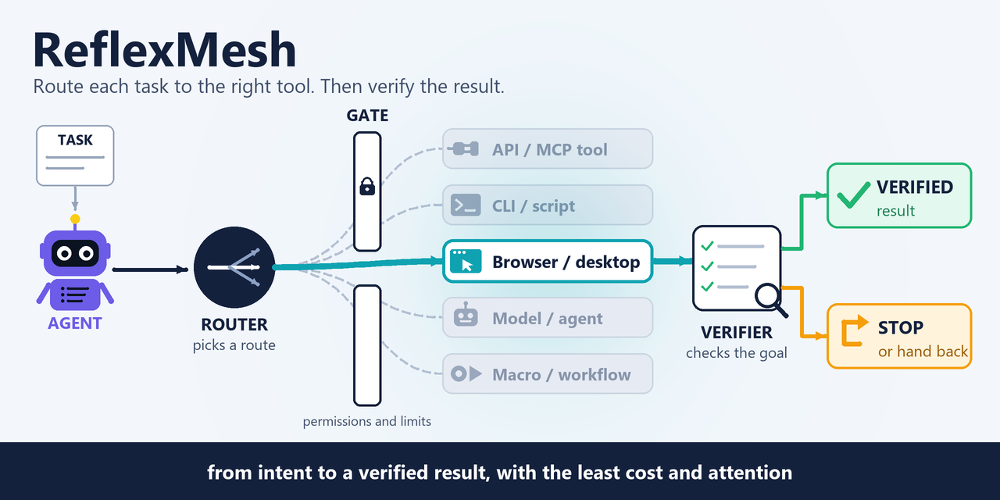
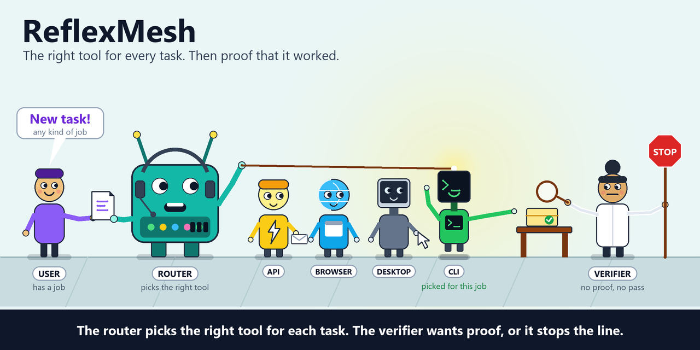

<p align="center">
  
</p>

<h1 align="center">ReflexMesh</h1>

<p align="center"><b>A decision-and-control layer for AI agents: route each task to a way of doing it (API, CLI, model or browser) with measured routing and an honest refusal, keep execution inside code-owned permissions and limits, and count a task done only when a verifier confirms. Today: routing, a routing study and a controlled-browser runtime spike. Early research code for people building agents.</b></p>

<p align="center">
  <a href="https://www.python.org/"></a>
  <a href="pyproject.toml"></a>
  <a href="#status"></a>
  <a href="pyproject.toml"></a>
</p>

<p align="center"><b>English</b> | <a href="README.ru.md">Русский</a></p>

```sh
python -m venv .venv && .venv/bin/python -m pip install -e .
.venv/bin/reflexmesh route --input examples/route-task.json
```

ReflexMesh is a universal decision-making and execution-coordination layer for AI agents: selecting tools and executors, enforcing constraints, and producing a verifiable result. Target paths include API/MCP tools, CLI/scripts, models and agents, computer use, macros and workflows. Jev is meant for bounded choice, the LLM for planning and generating content; code controls permissions and execution, and a verifier checks the result. The browser is the first applied scenario; desktop is added after V1.0. Interactive interfaces do not define the project's boundaries. This is the target concept; its currently implemented scope is described below.

**What exists today:** three things. **Routing** — a task goes in and a JSON routing decision comes out, from a fixed-order stub by default or from the real JevRouter over HTTP, with an honest refusal when no allowed route fits; this is the only part that is a product surface. **A measured routing study** — frozen protocols, labelled datasets and dated reports that compare hand-written rules, Jev and an LLM, and test refusal behaviour. **A controlled-browser runtime** — an experimental `reflexmesh run` that executes one bounded subtask on a local fixture site under code-owned permissions, limits, cancellation and a verifier; its acceptance gates are still open. Around them sits a documentation system (north star, target architecture, sixteen invariants, roadmap, status, ADRs, specifications and research reports). API/MCP, CLI, desktop, macro and workflow executors are target directions, not integrations — see [Status](#status).

It is early research code: the package has no runtime dependencies, nothing here executes a general task, and a selected route is a recommendation, never a completed job. The [status and known limits](#status) say exactly what has and has not been measured.

**Contents:** [In plain words](#in-plain-words) · [What's inside](#whats-inside) · [How it works](#how-it-works) · [Quick start](#quick-start) · [Why ReflexMesh?](#why-reflexmesh) · [Routing in depth](#routing-in-depth) · [The execution runtime](#the-execution-runtime-experimental) · [Evidence and experiments](#evidence-and-experiments) · [Status](#status) · [Direction and documents](#direction-and-documents) · [Running](#running) · [Checks](#checks) · [JevRouter setup](#jevrouter-v02) · [Reference](#reference) · [Troubleshooting](#troubleshooting)

## In plain words

### The problem

An AI agent that is asked to do something usually has several ways to do it: call an API or an MCP tool, run a script, ask a model, or drive a browser. Which way is best depends on what is available, what is allowed, what it costs and whether the result can be checked. In practice the model is left to improvise all of that: it picks a path, it decides what it is allowed to do, and it announces "done" on its own word. A browser run can finish "successfully" while the form was never submitted, and an agent that cannot do a task often still picks the nearest wrong tool instead of saying so.

### Who it is for

- **People building agents** who want a thin decision layer next to their agent (Pi is the first intended client) rather than yet another agent framework.
- **Researchers** who want to see, with frozen protocols and published numbers, whether a small routing model can replace an LLM for the "which way?" decision.
- **Contributors** who care about the guarantees an execution layer should keep: code-owned permissions, bounded attempts, evidence-backed success.

### What you get

- **A routing decision, honestly labelled.** A strict Task goes in; a JSON decision comes out with a clear status (selected, refusal, confirmation needed, adapter error), a reason code and distinct exit codes. The default provider says it is a stub and executes nothing.
- **Real routing through JevRouter, when you opt in.** A small routing model chooses among the routes the task allows; if no route fits it can say so, and an error is never papered over by the stub.
- **Numbers rather than claims.** Routing was evaluated against a frozen protocol, and refusal behaviour separately; the reports state the dataset, the comparator and the limits.
- **A worked example of a controlled runtime** (experimental). One browser subtask runs under permissions, step and model-call limits, a deadline and cancellation that the code owns, and counts as completed only if a verifier confirms the goal from fixture evidence, including a browser observation for `current_page`.
- **A written discipline.** Invariants, architecture decisions and staged specifications record what any future executor must keep.

### What it is not

- Not a finished agent framework, your own LLM, or a new RPA platform: it is a thin decision layer and an experimental runtime around existing components.
- Not a task executor: no general task execution ships today. A selected route is a recommendation; the browser runtime is a controlled spike on a fixture site.
- Not offline or cross-platform by promise: the Jev path assumes a cloud provider, and `reflexmesh run` needs a POSIX environment (Linux or WSL).
- Not a measured claim about computer use: the routing study measured routing only, and the V0.5 runtime has no completed execution-quality acceptance matrix or model-cost measurement.
- Not an integration hub: the API/MCP, CLI, desktop, macro and workflow routes in the target picture are directions, not connectors.

### Glossary

| Term | Meaning here |
|---|---|
| **Route** | A class of way to do a task. The current catalogue is `CUA` (computer use), `LLM` and `PERCEPTION`; it is an experimental set for V0, not the final classification. |
| **Task** | The strict JSON input for routing: id, goal, the routes the system is capable of and the routes allowed. |
| **Capabilities / allowed routes** | Declarations, not probes: capabilities say what could be used, allowed routes say what may be used. Neither checks that an executor is connected. |
| **Stub** | The default router: picks the first eligible route in a fixed order and never reads the goal. |
| **Jev / JevRouter** | A small routing model and the local HTTP service that serves it; an upstream project ReflexMesh talks to. |
| **NONE candidate** | A "none of these fits" option the adapter offers Jev, which turns a poor match into an honest refusal. |
| **Verifier** | Code that checks the goal against evidence, such as server-side state; a run counts as done only when it confirms. |
| **TextSlot** | A versioned, immutable piece of text (`name@1`) that a task supplies and an action may type, so the model never invents content. |
| **Attempt supervisor** | The runtime part that owns admission, limits, cancellation and the terminal status of one execution attempt. |
| **Fixture site** | A local, isolated test website with a run id and an event log that the verifier reads. |

## What's inside

Status labels: unlabeled = implemented in this repository; **experimental** = implemented but with open acceptance gates or only a fixture scope; **research** = a recorded study, not a feature; **planned / target** = not built.

### Routing (the shipped surface)

- **Explicit contracts.** A strict `Task` (exactly five fields, at most 64 KiB, duplicate keys and non-finite numbers rejected) and a `RoutingDecision` JSON with status `selected` / `abstained` / `needs_confirmation` / `failed`, a reason code and distinct exit codes `0` / `3` / `4` / `5` / `2`. → [Routing in depth](#routing-in-depth)
- **Honest stub by default.** The default provider picks from the intersection of `capabilities` and `allowed_routes` in a fixed order and marks itself `is_stub=true`, `execution_performed=false`; it never analyses the goal. → [Running](#running)
- **Real routing through JevRouter.** An opt-in HTTP adapter to a local JevRouter (loopback only); on any error the model is **not** silently replaced by the stub. The V0.2 live gate is closed for OpenRouter; direct typesafe is not verified. → [JevRouter setup](#jevrouter-v02)
- **Honest refusal.** The adapter offers Jev a `NONE` candidate, so "no allowed route fits" becomes an `abstained` decision with `upstream_no_fitting_route`; `--no-none-candidate` restores the old behaviour. → [Evidence and experiments](#evidence-and-experiments)
- **Code-owned control.** Selecting a route never authorizes an action; form submission, publishing and other external effects are not permitted by the choice itself. → [Why ReflexMesh?](#why-reflexmesh)

### Evidence and research

- **Measured, not assumed.** Routing was evaluated against a fixed protocol (V0.3, verdict "useful") and refusal behaviour separately (V0.3b); the results and their limits are published under [`docs/research/`](docs/research/). → [Evidence and experiments](#evidence-and-experiments)
- **Live evidence and a keyless check.** Live routing through OpenRouter is documented (V0.2); `scripts/check_jevrouter_http.py` checks the integration against a local demo server with no keys. → [Checks](#checks)
- **Reproducible scripts.** Frozen datasets and protocols under `experiments/` and the run and score scripts under `scripts/` re-run the routing studies. → [Reference](#reference)

### Controlled browser runtime (experimental)

- **`reflexmesh run`.** Executes one bounded browser subtask on a loopback fixture site; the input is a strict `execution-task/0.1`, the routing and action providers are explicit, and the result is one JSON plus `result.json`, `trace.jsonl` and `evidence.jsonl`. → [The execution runtime](#the-execution-runtime-experimental)
- **Code-owned limits.** A wall-clock deadline, step and model-call limits, SIGINT cancellation, a worker process with a bounded grace period and recorded unknown effects. → [The execution runtime](#the-execution-runtime-experimental)
- **Permissions, TextSlots and a verifier.** Seven named permissions, immutable versioned text slots and five postcondition predicates checked against fixture-server evidence or, for `current_page`, a browser observation; `completed` is assigned by the runtime, never by the harness. → [The execution runtime](#the-execution-runtime-experimental)
- **A spike and recorded deterministic checks.** The V0.4 spike of SystemOneHarness + Browser Use under runtime veto, cancellation and deadline passed its checks; the historical V0.5 deterministic (U) report records 36 of 36 planned subcases, with [source-provenance and C12 coverage caveats](docs/research/V0.5-U-acceptance.md#static-review-addendum-2026-10-07); the real-browser (B) and live-Jev (J) acceptance subcases are pending. → [Status](#status)

### Documentation system

- **Direction, constraints and evidence in separate documents.** North Star, target architecture, sixteen invariants (`INV-01`..`INV-16`), roadmap V0 → V2.0, status, three ADRs, specifications V0.1–V0.5, research reports and guides. → [Direction and documents](#direction-and-documents)

### Not built yet

- **Executors beyond the browser spike** — direct API/MCP tools, CLI/scripts, models and agents as executors, desktop, macros, workflows: **target directions**, not integrations. → [Direction and documents](#direction-and-documents)
- **A task interface** — an MCP/HTTP Task API, the Pi integration and handoff (planned for V0.6); the `integrations/` directories are empty placeholders. → [Status](#status)
- **Perception (OCR/accessibility), ClawBridge, Skyvern, Ui.Vision, Cua adapters, a meso-level supervisor, recovery and a durable receipts store** — **planned**; the matching modules in `src/` are empty placeholders.
- **Capability discovery and self-extension** — a future direction only ([`docs/architecture/FUTURE_SELF_EXTENSION.md`](docs/architecture/FUTURE_SELF_EXTENSION.md)).

## How it works

<p align="center">
  
</p>

The picture shows the target design. Of the tools drawn, only a controlled browser path is being built; the others are directions, not implemented integrations.

1. **A task arrives** from an agent. Pi is the first intended client, but the core stays independent of it, so other agents and programs can send the same tasks.
2. **The router picks a route** from those the task declares allowed. Jev makes this bounded choice; the current CUA / LLM / PERCEPTION catalogue is an experimental set for V0, not the final classification.
3. **A gate owned by code** enforces permissions and limits before anything runs. Choosing a route authorizes nothing by itself.
4. **An executor acts** — for now, only a controlled browser executor is in scope.
5. **A verifier checks the goal.** The run counts as done only if the verifier confirms it; otherwise it stops with a reason, or hands the task back to the calling agent.

### What runs today

| Step | Today |
|---|---|
| 1. Task | `reflexmesh route` reads a Task JSON (file or stdin); `reflexmesh run` reads an `execution-task/0.1`. |
| 2. Router | The stub or the opt-in JevRouter adapter returns a decision; the result is a recommendation. |
| 3. Gate | In the runtime: the permissions list, limits and cancellation order are enforced by code in one supervised attempt. |
| 4. Executor | Only `browser.soh` (SystemOneHarness + Browser Use) on a loopback fixture site, an optional pinned dependency. |
| 5. Verifier | A read-only fixture verifier; no other verifier exists. |

## Quick start

Python 3.11+. From a clone (Bash; PowerShell equivalents are in [Running](#running)):

```sh
python -m venv .venv
.venv/bin/python -m pip install -e .
.venv/bin/reflexmesh route --input examples/route-task.json
```

The example input declares `CUA` and `LLM` as both capable and allowed. The output from the default stub looks like this:

```json
{"schema_version": "0.1", "task_id": "browser-demo", "status": "selected", "route": "CUA", "eligible_routes": ["CUA", "LLM"], "reason_code": "stub_fixed_order", "provider": "stub", "is_stub": true, "execution_performed": false, "confidence": null}
```

This is the stub's fixed order, not an analysis of the goal, and nothing was executed. To route through the real JevRouter, see [JevRouter (V0.2)](#jevrouter-v02). To run the tests: `python -m unittest discover -s tests -v`.

## Why ReflexMesh?

- **If** your agent can do a job several ways — a direct API or MCP tool, a script, a model, a browser — **then** ReflexMesh is meant to choose among the ways you allow and let code, not the model, own permissions and execution.
- **If** "the agent says it is done" is not good enough, **then** completion here is assigned by the runtime and accepted only when a verifier confirms the goal. The V0.4 spike showed why: the harness's own `completed` status was wrong in both directions, and a verifier over server-side state was right in both observed cases.
- **If** you want an honest "none of these routes fits", **then** the adapter offers Jev a `NONE` candidate; in the V0.3b study this raised Jev's correct-refusal rate from 22% (previous adapter) to 96% over the same refusal cases, with no loss on ordinary tasks (the 25% in the V0.3 report is that study's separate 8-case subset).
- **If** routing has to be cheap and fast, **then** the V0.3 study reports Jev at accuracy 1.00 (the same as gpt-5.5) against 0.65 for hand-written rules, while, compared with the gpt-5.5 reference, Jev's p50 latency is 0.6 s against 6.4 s and its cost roughly $0.00002 against $0.002 per decision (the rules are faster and free but far weaker on paraphrased tasks) — figures as recorded in [`docs/STATUS.md`](docs/STATUS.md) and the [V0.3 report](docs/research/V0.3-routing.md).

It is **not** a finished agent framework, your own LLM, or a new RPA platform; it is a thin integration runtime and decision layer around existing components. No general task execution ships today: a selected route is a recommendation, never a completed job, and the browser runtime is still a controlled spike on a fixture site. Fully offline work and support for every OS are not promised — the Jev path assumes a cloud provider. An unsupported task gets an explicit refusal or a hand-back.

## Routing in depth

`reflexmesh route` is the whole shipped surface. It reads one Task, asks a provider for a decision and prints it as JSON; nothing is executed.

**Task 0.1** has exactly five fields: `schema_version` (`"0.1"`), `task_id` (at most 128 characters), `goal` (at most 10,000 characters), `capabilities` and `allowed_routes` (unique values from `CUA`, `LLM`, `PERCEPTION`). Missing or extra fields, duplicate JSON keys, non-finite numbers and input over 64 KiB are rejected. `capabilities` and `allowed_routes` are declarations, not probes: they say what could and may be used, and neither checks that an executor exists.

**The decision** carries `status`, `route`, `eligible_routes`, `reason_code`, `provider`, `is_stub`, `execution_performed` and `confidence`.

| Status | Exit | Meaning |
|---|---|---|
| `selected` | 0 | A route was chosen from the eligible set (`stub_fixed_order` for the stub, `upstream_selected` from Jev). |
| `abstained` | 3 | No eligible route (`no_eligible_route`) or Jev found no fitting one (`upstream_no_fitting_route`, `upstream_no_decision`). |
| `needs_confirmation` | 4 | JevRouter asked for confirmation (`upstream_confirmation_required`); no further action is taken. |
| `failed` | 5 | The adapter or provider failed; the decision still prints as JSON on stdout and the stub is **not** substituted. |
| (input error) | 2 | Invalid argument, read or validation error: JSON on stderr, empty stdout. |

**Providers.**

- *Stub* (default): the first route in the order CUA, LLM, PERCEPTION that is both capable and allowed; `provider` is `stub`, `is_stub=true`, `confidence=null`.
- *JevRouter* (`--provider jevrouter`): a decision-only HTTP adapter to a local JevRouter at `http://127.0.0.1:PORT` (loopback only, no proxy, redirect or retry; `--timeout` is a socket I/O timeout of at most 120 s; responses over 1 MiB are rejected). It describes the eligible routes to Jev, filters and validates the answer, and by default also offers the `NONE` candidate ([ADR-0003](docs/architecture/ADR-0003-none-candidate-refusal.md)). The demo upstream is rejected unless `--allow-demo` is given and is then marked `is_stub=true`. A JevRouter decision uses `schema_version` `0.2` and adds a `trace` (request and response hashes, elapsed time and an upstream summary); it is a routing trace, not an audit trail.

**Known boundaries** (from [`docs/STATUS.md`](docs/STATUS.md)): there is no ReflexMesh task server; the adapter only makes outgoing HTTP calls to loopback JevRouter; a socket timeout is not an overall deadline and is not evidence for the future runtime's deadline invariant; `is_stub=false` and the service's provenance do not prove a model was called; a `needs_confirmation` reply is only a proposal, since there is no confirmation or follow-up execution mechanism; stdout trace is not an audit trail, and the upstream keeps its own receipts.

## The execution runtime (experimental)

`reflexmesh run` is the V0.5 minimal controlled browser runtime. It is a spike on a fixture site, not a way to run your own tasks, and its acceptance gates are open. One request executes one bounded subtask: SystemOneHarness owns the inner action loop, Browser Use executes browser actions, and ReflexMesh owns admission, permissions, counters, cancellation, terminal transitions and verification ([V0.5 specification](docs/specs/V0.5.md)).

```bash
reflexmesh run --input task.json --output-dir ./evidence-001 \
  --routing-provider stub --action-provider script --script script.json
```

- **Input.** An `execution-task/0.1` JSON with `task_id`, `revision`, `goal`, `allowed_executors` (only `browser.soh` is implemented), a `fixture` (loopback origin and run id), `start_path`, `permissions`, `text_slots`, `criteria` and `limits` (`wall_seconds`, `max_steps`, `max_model_calls`, `max_action_retries`, which must be 0). Extra fields, duplicate keys and invalid references are rejected before any attempt.
- **Permissions.** `navigate`, `type_text`, `toggle_setting`, `save_settings`, `submit_form`, `start_export`, `delete_account`; an action outside the task's list is refused before it reaches the browser.
- **TextSlots.** Versioned immutable texts (`name@1`); actions refer to a slot rather than carrying text, and criteria can refer to slots.
- **Criteria.** Four postconditions use fixture-server state and events: `settings_saved`, `form_submitted_once`, `export_completed_once`, `account_intact`. `current_page` instead requires a matching browser observation of the current URL and target; a historical server GET is insufficient.
- **Providers.** `--routing-provider stub|jevrouter` and `--action-provider script|jev`, both explicit; `script` is a deterministic test fixture supplied by `--script`.
- **Outcome.** One JSON on stdout and `result.json`, `trace.jsonl`, `evidence.jsonl` in the output directory. `attempt_status` is `completed` (exit 0), `blocked` (3), `incomplete` (4), `failed` (5) or `cancelled` (130); input errors and output-directory preparation errors (before the attempt starts) exit 2, while a failure to write the output files after the run is reported as `failed` with stop reason `output_error` and exits 5. `task_outcome` is `pass` only for a completed attempt whose checks all pass. Success is never read from the harness's own status.
- **Verification coverage.** Completion requires every postcondition, settled actions, and all six mandatory runtime assessments to pass before the terminal gate accepts it. Immutable-slot assessment now uses sealed, attempt-bound evidence of the exact payload handed to the supported driver; the local-budget assessment uses synchronized counters. Permissions, ownership, dispatch ordering, and no uncertain repeats remain `unknown`. Missing slot receipts also remain `unknown`; an actual mismatched handoff is a sticky failure. Thus passing postconditions still cannot complete ordinary runs. Slot evidence does not prove focus, final DOM values, or driver-internal behavior. V0.5 acceptance remains incomplete and this stage's regression sources are unrun. See the [handoff evidence scope](docs/guides/V0.5-local-run.md#immutable-slot-handoff-evidence).
- **Control.** A supervisor with a deadline that starts before availability checks, routing and startup; step and model-call counters; a dispatch and cancellation gate with a defined order; a worker process with bounded grace and cleanup; unresolved actions recorded as unknown effects rather than guessed.
- **Budget configuration.** Elapsed task work is the primary time budget and can span hours (`wall_seconds: 7200` for two hours). Set an individual time/step/model-call limit to `null`, use `limits: null`, or pass `--no-limits` to disable budgets explicitly. Cancellation, permissions, verification and bounded cleanup remain active. Zero is not an unlimited marker. See [budget semantics and examples](docs/guides/V0.5-local-run.md#task-budgets-hours-and-explicit-unlimited-mode).
- **Router accounting.** Routers use a common replaceable interface; only stub and JevRouter adapters are implemented. `max_model_calls` bounds locally controlled provider requests. JevRouter remains available with finite local limits, but its internal model calls are unknown/unlimited and the total is reported as `null`, never as one HTTP request or a verified global cap. See [router capabilities and usage](docs/guides/V0.5-local-run.md#replaceable-routers-and-honest-model-call-accounting).
- **Platform and dependencies.** The first supported environment is Linux or WSL with a fresh browser process per attempt, a loopback fixture, and pinned optional dependencies (SystemOneHarness and Browser Use). The supervisor uses the POSIX `fork` start method, so `reflexmesh run` does not start on native Windows (measured on Windows with Python 3.13). The routing CLI and the V0.1–V0.3 tests are not affected.

For the step-by-step local checks, the fixture server and the U manifest, see the [V0.5 local run guide](docs/guides/V0.5-local-run.md).

## Evidence and experiments

Every claim below is tied to a dated report with its commit and environment; the reports, not this table, are authoritative.

| Study | What was measured | Result | Limits |
|---|---|---|---|
| V0.2 live | ReflexMesh → JevRouter (pinned upstream commit) → OpenRouter, five pass items plus extended scenarios | Live gate closed for OpenRouter ([report](docs/research/V0.2-live-openrouter.md)) | Direct typesafe provider not verified |
| V0.3 routing | 75 labelled cases (RU and EN) over CUA / LLM / PERCEPTION: rules (1 pass) vs Jev and an LLM (`gpt-5.5` through pi), 3 passes each | Verdict "useful". Accuracy over the 60 single, ambiguous and paraphrase cases: Jev 1.00 (same as `gpt-5.5`) vs 0.65 for rules (0.13 on paraphrased tasks); p50 latency 0.60 s vs 6.44 s; about $0.00002 vs $0.002 per decision ([report](docs/research/V0.3-routing.md)) | One run, this catalogue; the `gpt-5.5` cost is a price-list estimate; Jev was weak on semantic refusal (correct refusal 25% vs 79% for the LLM on that 8-case subset) |
| V0.3b refusal | 84 cases × 3 passes × four Jev variants, plus the LLM as reference | Offering a `NONE` candidate raised the correct-refusal rate from 22% (previous adapter) to 96% with no loss on ordinary tasks; implemented in the adapter ([report](docs/research/V0.3b-refusal.md)) | A harder set is an open question (ceiling effect for Jev and the LLM) |
| V0.4 spike | SystemOneHarness + Browser Use under runtime veto, cancellation and deadline on a fixture site | 18 of 18 deterministic runs and 12 of 12 with Jev passed; a verifier over server state was right where the harness's own `completed` status was wrong in both directions ([report](docs/research/V0.4-spike.md)) | A fixture site, a specific environment, step-by-step mode |
| V0.5 U acceptance | 36 deterministic subcase rows, 33 distinct test identifiers, with fakes and fault injection | Historical report records 36/36; its source SHA `1887114` is unavailable in GitHub. A separate reproduction on published `fe088e6` is reported ([provenance and coverage note](docs/research/V0.5-U-acceptance.md#static-review-addendum-2026-10-07)) | C12 log redaction covers only the executor-unavailable path. B and J acceptance remain pending; the gate is open |

To re-run the routing studies, see the frozen protocols and datasets under `experiments/v03` and `experiments/v03b` and the run and score scripts `scripts/v03_run.py`, `scripts/v03_score.py`, `scripts/v03b_run.py`, `scripts/v03b_score.py`.

## Status

**Current verified milestone: V0.4.** The [V0.4 report](docs/research/V0.4-spike.md)
documents the controlled SystemOneHarness + Browser Use spike. The V0.5 execution
code is in progress; its deterministic runtime and fixture checks do not yet close
the real-browser or Jev acceptance gates. See the [V0.5 specification](docs/specs/V0.5.md)
and [local run guide](docs/guides/V0.5-local-run.md). The [2026-10-07 static addendum](docs/research/V0.5-U-acceptance.md#static-review-addendum-2026-10-07) distinguishes recorded results, available source provenance and remaining coverage; no new execution is claimed. Earlier V0.2 live routing
evidence remains in the [live report](docs/research/V0.2-live-openrouter.md).

### Known limits

- **Declarations are not probes.** `capabilities` and `allowed_routes` are a routing filter, not a check that an executor is available and not full authorization.
- **Routing only talks to loopback.** The routing adapter's network path is outgoing HTTP to a local JevRouter; there is no proxy, redirect or retry, and no ReflexMesh task server. A socket I/O timeout is not an overall deadline.
- **A selected route is a recommendation.** `needs_confirmation` returns a proposal; there is no confirmation or follow-up execution mechanism. There is no automatic fallback to the stub.
- **Evidence is scoped.** Test counts and configurations belong to the runs named in the reports; updating documentation is not a new run. Direct typesafe was not verified live.
- **The runtime gate is open.** An [independent review](docs/research/V0.5-review-2026-09-25.md) records one real-Chromium form smoke and selector-map/node-identity probes on `fe088e6`. These historical observations do not satisfy the required B acceptance matrix; B and J remain pending. Document/frame identity, enabled state, form destination, policy revision and the full execution-constraint assessments remain incomplete. A worker crash while holding the gate lock and full process-tree cleanup timing have not been demonstrated; model cost is unmeasured. The runtime needs Linux or WSL.
- **Invariant coverage is partial.** Routing and CLI work without Pi; the rest of the invariants are requirements for later stages, and conformance of execution paths is not yet established.

### Roadmap at a glance

| Stage | Scope | State |
|---|---|---|
| V0.1 | Task, decision, CLI, explicit stub | Implemented and verified |
| V0.2 | JevRouter HTTP adapter, refusal reasons, trace | Live gate closed for OpenRouter |
| V0.3 / V0.3b | Routing study; refusal study and the NONE candidate | Done (verdict "useful"); NONE implemented |
| V0.4 | SystemOneHarness + Browser Use spike | Done |
| V0.5 | Minimal controlled browser runtime | In progress; historical U 36/36 recorded with provenance/coverage caveats; B and J pending |
| V0.6 | MCP interface, Pi integration, handoff | Not started |
| V1.0 | First finished browser MVP from Pi/MCP | Planned |
| V1.1–V2.0 | OCR, desktop, recovery, queue/UI, durable workflows, several executor classes | Preliminary order, not a promise |

## Direction and documents

- [North Star](docs/NORTH_STAR.md) — the product goal and signs of usefulness.
- [Target architecture](docs/architecture/TARGET_ARCHITECTURE.md) — macro/meso/micro, the runtime and executors.
- [Invariants](docs/architecture/INVARIANTS.md) — mandatory constraints.
- [V0–V2 plan](docs/ROADMAP.md) — stages and exit criteria.
- [Current status](docs/STATUS.md) — implementation, evidence and open gates.
- [Documentation map](docs/README.md) — specifications, reports and update rules.

V1.0 is the first finished browser MVP from Pi/MCP; its scope is not widened.
V2.0 is the target of the first coherent system with several classes of executors,
selected tasks without a GUI, browser/desktop and recovery. The concrete set of
adapters and scenarios is determined after V1.0, with no promise to connect them all.
Pi remains a separate client. The choice of ClawBridge, Skyvern and Ui.Vision will be
refined after checking need and compatibility; empty directories do not mean support.

## Running

Python 3.11+. Install into a virtual environment (Bash):

```sh
python -m venv .venv
.venv/bin/python -m pip install -e .
.venv/bin/reflexmesh route --input examples/route-task.json
```

PowerShell:

```powershell
python -m venv .venv
.\.venv\Scripts\python.exe -m pip install -e .
.\.venv\Scripts\reflexmesh.exe route --input examples/route-task.json
```


Without installing the package (Bash):

```sh
PYTHONPATH=src python -m reflexmesh route --input examples/route-task.json
```

PowerShell without installing:

```powershell
$env:PYTHONPATH = "src"
python -m reflexmesh route --input examples/route-task.json
```

`--input -` reads JSON from stdin. By default a stub is used:
the route is selected from the intersection of
`capabilities` and `allowed_routes` in the order CUA, LLM, PERCEPTION.
The stub does not analyse the goal; the `provider` field equals `stub`, `is_stub=true`,
`execution_performed=false`, `confidence=null`. Declaring capabilities
does not mean executors are connected. The result is not task execution.

Exit codes: `0` — route selected, `3` — refusal, `4` — confirmation required,
`5` — adapter/provider error, `2` — input error.
The decision (including `failed` from the adapter, exit 5) is JSON on stdout.
An argument/read/validation error (exit 2) is JSON on stderr, and stdout is empty.
`--help` and `--version` print plain text.

## Checks

```sh
python -m unittest discover -s tests -v
```

Specifications: [V0.1](docs/specs/V0.1.md), [V0.2](docs/specs/V0.2.md).
Evidence: [V0.1 report](docs/research/V0.1-validation.md),
[V0.2 report](docs/research/V0.2-validation.md). They refer to the versions and
environments named in the reports, not to an arbitrary state of main.

## JevRouter (V0.2)

The default stub is kept; the real integration is switched on explicitly.
Install the upstream separately (Node.js 20+, Git):

```sh
git clone https://github.com/BillionsBobby/JevRouter.git
cd JevRouter
git checkout f944acb6530621bced023352e2358a63218bf4d9
npm ci --ignore-scripts
npm run build
node dist/cli.js serve --provider openrouter --port 8787
```

Before starting the server, set `OPENROUTER_API_KEY` in its environment.
You can create one on the [OpenRouter keys page](https://openrouter.ai/settings/keys):
there is no separate JevRouter key. If you already have a direct TypeSafe key,
set `TYPESAFE_API_KEY` or `JEV_API_KEY` and use `--provider typesafe`.
Keys are not passed in ReflexMesh's Task or CLI.
The server uses its own policy and saves receipts in `.jevrouter/`
in its working directory; take that into account when choosing the directory and the content of tasks.
With a real provider the goal is sent to a cloud model.

In a second terminal from the ReflexMesh directory, after installing into `.venv` (Bash):

```sh
.venv/bin/python -m reflexmesh route --provider jevrouter --input examples/route-task.json
```

In PowerShell use `.\.venv\Scripts\python.exe -m reflexmesh` with the same arguments.

`--jev-url http://127.0.0.1:8787` and `--timeout 30` are available (socket I/O,
not an overall deadline). On error the model is not replaced by the stub. On a
`needs_confirmation` reply no further actions are performed. The adapter offers Jev
the `NONE` candidate: if no allowed route fits, the answer is
`abstained` with `upstream_no_fitting_route` ([ADR-0003](docs/architecture/ADR-0003-none-candidate-refusal.md)).
`--no-none-candidate` restores the previous behaviour.

Without a key you can run the upstream with `--provider demo` and the client with
`--allow-demo`. The reply will be marked `is_stub=true`. Without this flag demo is rejected.
An example with two routes may produce an honest refusal because of a low score.

Checking the integration without keys after building the upstream:

```sh
python scripts/check_jevrouter_http.py --upstream-dir /path/to/JevRouter
```

The script starts and stops a local demo server itself in a temporary directory.

- [V0.2 specification](docs/specs/V0.2.md)
- [Step-by-step V0.2 live run on Windows](docs/guides/V0.2-live-run-windows.md)
- [V0.2 validation report](docs/research/V0.2-validation.md)
- [V0.2 live run via OpenRouter](docs/research/V0.2-live-openrouter.md) and [extended scenarios](docs/research/V0.2-live-extended-openrouter.md)

## Reference

### Commands and exit codes

| Command | What it does | Exit codes |
|---|---|---|
| `reflexmesh route [--input FILE\|-] [--provider stub\|jevrouter] [--jev-url URL] [--timeout S] [--allow-demo] [--no-none-candidate]` | Routing only; prints a RoutingDecision JSON | `0` selected, `3` abstained, `4` needs confirmation, `5` adapter or provider error, `2` input error |
| `reflexmesh run --input FILE --output-dir DIR --routing-provider stub\|jevrouter --action-provider script\|jev [--script FILE] [--chrome FILE] [--jev-url URL] [--timeout S] [--no-limits]` | Executes one bounded browser subtask on a fixture site (experimental, POSIX only) | `0` completed, `3` blocked, `4` incomplete, `5` failed (this includes a write failure for `trace.jsonl`, `evidence.jsonl` or `result.json` after the run: stop reason `output_error`), `130` cancelled, `2` input error or output-directory preparation error (before the attempt starts: the directory cannot be created, is not empty, or `trace.jsonl` cannot be created) |
| `reflexmesh --version`, `--help` | Plain text | |

### JevRouter adapter failure codes

When the adapter fails the decision has `status` `failed` and one of these reason codes: `http_error`, `response_too_large`, `transport_timeout`, `transport_error`, `unsupported_provider`, `demo_not_allowed`, `provider_error`, `invalid_response`.

### Repository layout

| Path | Role |
|---|---|
| `src/reflexmesh/contracts` | The strict Task, RoutingDecision and ExecutionTask contracts. |
| `src/reflexmesh/routing` | The stub and the JevRouter adapter. |
| `src/reflexmesh/runtime`, `verification`, `adapters/system_one` | The experimental execution runtime: CLI, attempt supervisor, fixture verifier and the SystemOneHarness / fixture-browser adapter. |
| `src/reflexmesh/{perception,supervision,text,tracing}`, `routing/policies.py`, `runtime/handoff.py`, `adapters/{clawbridge,cua,skyvern,uivision}` | Empty placeholder modules for planned areas; they contain no code. |
| `experiments/` | Frozen routing protocols and datasets (`v03`, `v03b`), the ADR-0003 end-to-end data (`adr0003`), the V0.4 spike and V0.5 fixture site and U manifest. |
| `scripts/` | Keyless JevRouter check, the ADR-0003 end-to-end check, the V0.2 live collectors, and the V0.3 and V0.3b run and score scripts. |
| `tests/` | `unittest` suites for V0.1–V0.3b and the V0.5 runtime, harness, fixture, preflight and browser adapter. |
| `docs/` | North Star, target architecture, invariants, roadmap, status, ADRs, specifications, research reports and guides. |
| `integrations/`, `examples/`, `docker-compose.yml` | Placeholders (`integrations/`) and an example Task; `docker-compose.yml` is empty. |

### The documentation system

Each kind of fact has one home: the goal is the [North Star](docs/NORTH_STAR.md), the concept is the [target architecture](docs/architecture/TARGET_ARCHITECTURE.md), the binding constraints are the [invariants](docs/architecture/INVARIANTS.md) (`INV-01`..`INV-16`), the order of work is the [roadmap](docs/ROADMAP.md), and what actually works is [`docs/STATUS.md`](docs/STATUS.md) with the reports it links. Each increment has a specification under `docs/specs/`; a change to an invariant is recorded as an ADR ([ADR-0001](docs/architecture/ADR-0001-invariant-review.md), [ADR-0002](docs/architecture/ADR-0002-routing-effects-and-loop-control.md), [ADR-0003](docs/architecture/ADR-0003-none-candidate-refusal.md)). A description of future behaviour is never evidence that it is implemented. The [documentation map](docs/README.md) lists every document; most of the project documents are in Russian.

## Troubleshooting

| Symptom | What it means and what to do |
|---|---|
| `reflexmesh run` fails with `cannot find context for 'fork'` | The execution runtime uses the POSIX `fork` start method. Run it on Linux or WSL; the routing CLI works on Windows. |
| `reflexmesh run` reports `blocked` with `executor_unavailable` | The optional pinned SystemOneHarness, Browser Use or a Chromium binary is missing. A blocker is not a successful browser run; see the [V0.5 local run guide](docs/guides/V0.5-local-run.md). |
| `route --provider jevrouter` exits 5 | The adapter could not get a valid answer (see the failure codes above). The stub is deliberately not substituted; check that JevRouter is running at the loopback address you passed and that its provider key is set in its own environment. |
| `demo_not_allowed` | The upstream is the demo provider. Pass `--allow-demo` to accept it (the reply is then marked `is_stub=true`), or run the upstream with a real provider. |
| "JevRouter endpoint must be http://127.0.0.1:PORT" | The adapter accepts only loopback HTTP, with no credentials, query or fragment in the URL. |
| Stub options rejected | `--jev-url`, `--timeout`, `--allow-demo` and `--no-none-candidate` require `--provider jevrouter`. |
| The route is `selected` but nothing happened | By design: routing is not execution. A selected route is a recommendation and `execution_performed` is `false`. |
| `route` exits 2 and prints nothing on stdout | An argument, read or validation error: the JSON error is on stderr. The task text is deliberately not echoed. |
