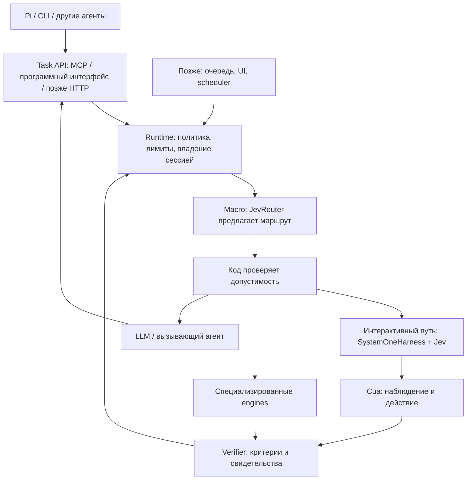

# Целевая архитектура ReflexMesh

Дата: 2026-09-24. Статус: концепция, к которой идём; не схема уже работающего продукта.
Назначение — [North Star](../NORTH_STAR.md), фактический объём — [STATUS](../STATUS.md).

## Общая схема

Все узлы, кроме текущих CLI, контрактов routing и HTTP-адаптера JevRouter,
пока целевые. Стрелка к executor обозначает передачу только разрешённой работы.
Control plane использует тот же runtime; второй путь обхода политики не появляется.
Результат проверки возвращается runtime, который определяет продолжение или
терминальный исход. Handoff не является завершением исходной цели.

## Ответственность компонентов

| Слой | Ответственность | Исходный кандидат и статус |
|---|---|---|
| Клиент/planner | Принять цель, декомпозировать, подготовить текст, показать результат | Pi — основной будущий клиент; CLI уже есть |
| Контракты / Task API | Единая семантика задач и результатов независимо от транспорта | Python-контракты routing есть; execution/MCP ещё нет |
| Runtime | Допуск, бюджет, отмена, владение средой, вызов адаптеров, агрегация результата | Собственный тонкий слой, пока заготовки |
| Macro decision | Выбрать класс исполнителя среди разрешённых | JevRouter HTTP-адаптер есть, live gate открыт |
| Micro loop | Повторять observe → bounded choice → action в рамках лимитов | SystemOneHarness + Jev, совместимость ещё предстоит проверить |
| Observation/action | Структурированные наблюдения и явные действия браузера/desktop | Cua, пока кандидат интеграции |
| Perception | Извлечь информацию, когда текущего наблюдения недостаточно | DOM/AX где доступны; RapidOCR, позже другие OCR/VLM — кандидаты |
| TextSlots | Связать версию подготовленного текста с конкретным вводом | Собственный минимальный слой, не реализован |
| Verification | Проверить критерии по связанным с задачей свидетельствам | Собственный слой, не реализован |
| Meso supervision | Выбрать recovery/handoff/смену стратегии | Сначала код и явные причины; Jev-supervisor позднее по измерениям |
| Control plane | Очередь, история, UI, согласования, scheduling, lifecycle | ClawBridge — кандидат после доказанного execution-пути |
| Специализированные engines | Длительные web workflows и повторяемые макросы | Skyvern / Ui.Vision — последующие кандидаты |

Названия продуктов задают исходный выбор, не гарантируют совместимость или
наличие всех нужных функций. Конкретные гарантии каждого адаптера проверяются
на закреплённой версии. В частности, единый browser/desktop интерфейс и
perception Cua — цели проверки, а не уже подтверждённые возможности ReflexMesh.

## Macro / meso / micro

Macro получает ограниченную подзадачу и каталог возможностей. В V0 каталог
содержит CUA, LLM, PERCEPTION. CUA здесь — класс работ, Cua — конкретный
кандидат драйвера. Дальнейшее расширение на model/agent/tool/skill/CLI возможно
через тот же принцип ограниченного выбора, но не входит в V1.0.

Meso получает состояние попытки и выбирает способ продолжения. На первом этапе
достаточны детерминированная остановка и структурированный handoff. Поздний
Jev-supervisor не получает права увеличивать бюджет или обходить разрешения.

Micro выбирает действие из набора, привязанного к свежему наблюдению. LLM
подготавливает новое содержание вне micro-loop. Jev выбирает TextSlot и цель
ввода; runtime проверяет применимость и вызывает драйвер.

## Цикл выполнения V1.0

1. Клиент передаёт подзадачу, ограничения, текстовые значения и критерии принятия.
2. Runtime проверяет поддержку задачи и применимость критериев, получает владение сессией.
3. Macro предлагает маршрут; runtime проверяет возможность исполнения либо handoff.
4. Интерактивный путь получает наблюдение и конечный набор допустимых действий.
5. Jev предлагает действие; код повторно проверяет ограничения и предусловия.
6. Драйвер выполняет действие; новый результат наблюдается и проверяется.
7. Runtime продолжает в пределах лимита, завершает с подтверждением либо возвращает блокер.

FINISH модели — предложение. Постусловие может быть false до достижения цели;
нарушенное ограничение выполнения нельзя стереть последующим успехом.
Отмена останавливает новые действия; поздний ответ дополняет свидетельства,
не меняя уже принятого терминального состояния попытки. Подробные правила —
INV-08–12, они не переопределяются этой схемой.

## Perception и автономные engines

Структурированные наблюдения предпочтительны, если достаточны для задачи.
OCR/VLM подключаются по необходимости; они не обязательны на каждом шаге.
Собственный CuaEnvironment/candidate builder добавляется после воспроизводимого
обоснования: несовместимость, качество, задержка или ограничения контроля.
Сначала в V0.4 проверяется нативный SystemOneHarness ↔ Cua MCP.

Пошаговый адаптер позволяет проверять каждое действие. Автономный engine
может скрывать внутренний цикл: ему передаются только задачи, ограничения
которых он способен обеспечить. Внешний verifier проверяет цель независимо
от upstream completed. Неизвестный эффект неидемпотентного действия не повторяется вслепую.

## Что работает сейчас

CLI читает Task 0.1 и вызывает stub либо Python HTTP-клиент к локальному
JevRouter. Stub возвращает схему решения 0.1, HTTP-адаптер — 0.2. Это
routing-only: исполнителей, task server, очереди и автоматического handoff нет.
HTTP здесь — **исходящий вызов JevRouter**, не готовый HTTP Task API ReflexMesh.

Каркас каталогов показывает предполагаемые границы, а не наличие реализации:
contracts, routing, runtime, perception, text, verification, tracing, supervision,
adapters; отдельно integrations/pi, mcp, http. Жёсткие инфраструктурные
абстракции до подтверждённой необходимости не вводятся.

## Открытые архитектурные вопросы

- Совместимы ли MCP-схемы Cua с конечным action space SystemOneHarness?
- Какой browser/desktop backend и какие ОС действительно поддержит первый адаптер?
- Как обеспечить общий deadline и отмену за границей процесса/провайдера?
- Какие наблюдения надёжно подтверждают цель, а какие дают только unknown?
- Где Jev даёт преимущество перед правилами или LLM на одинаковых сценариях?
- Достаточен ли ClawBridge для нужного lifecycle без дублирования runtime?

Каждый вопрос закрывается экспериментом или ADR; ни один не считается решённым
только из-за наличия компонента на схеме.
