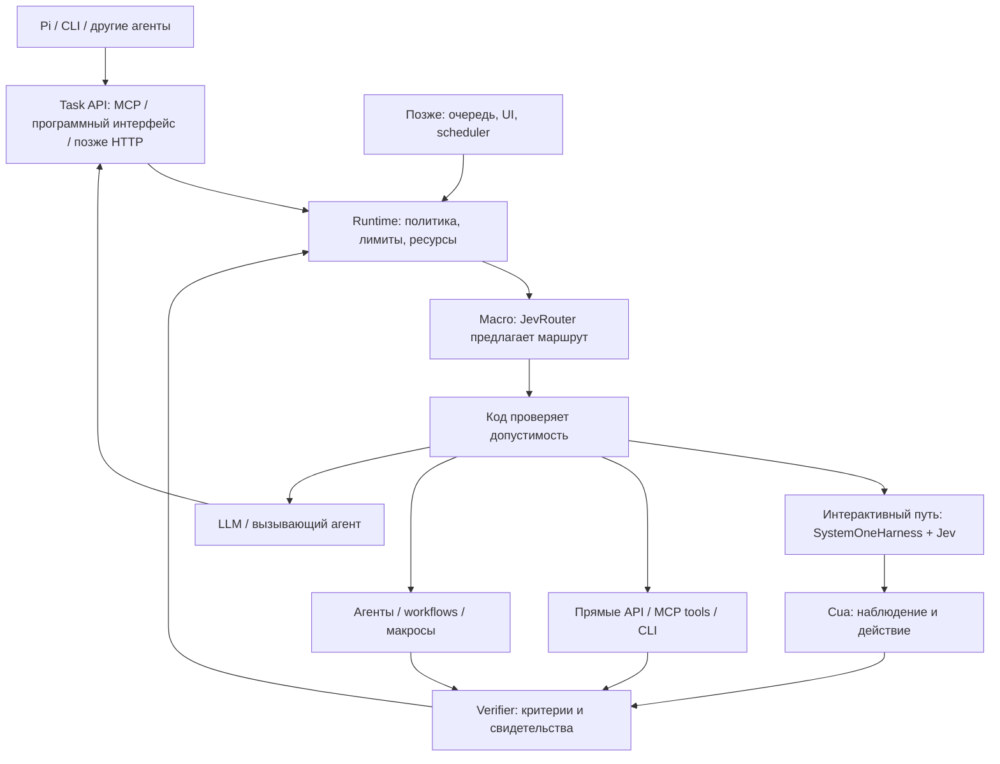

# Целевая архитектура ReflexMesh

Дата: 2026-09-24. Статус: концепция, к которой идём; не схема уже работающего продукта.
Назначение — [North Star](../NORTH_STAR.md), фактический объём — [STATUS](../STATUS.md).

## Универсальное ядро и прикладные адаптеры

Ядро работает с задачей, доступными возможностями, исполнителем, ограничениями,
попыткой и результатом. Оно не требует окна, DOM, скриншота или браузерной сессии
в каждой задаче. Эти данные и действия принадлежат соответствующим адаптерам.
Владение ресурсом применяется там, где есть общий изменяемый ресурс; для UI
это сессия/desktop, для других путей — их собственные ресурсы и гарантии.

Task API на входе принимает задачи от клиентов. MCP tool/API на выходе —
возможные средства исполнения. Это разные роли одного протокола, и ни одну
нельзя считать реализованной из-за наличия другой.

Прямой вызов API/CLI не обязан проходить через Cua или SystemOneHarness.
Наблюдение, действие и проверка зависят от адаптера: например, состояние
объекта сервиса и его ID, содержимое файла или результаты проверки артефакта.
Одного HTTP 200 или exit code 0 недостаточно для произвольной цели: подтверждаются
её критерии. Micro-loop нужен только исполнителям с последовательным выбором
действий; он не является обязательной обёрткой вокруг каждого инструмента.

Браузер — первый execution-путь V1.0; desktop планируется после V1.0.
Расширяемость не требует заранее
строить plugin framework или реализовывать все классы адаптеров.

## Общая схема

Все узлы, кроме текущих CLI, контрактов routing и HTTP-адаптера JevRouter,
пока целевые. Стрелка к executor обозначает передачу только разрешённой работы.
Control plane использует тот же runtime; второй путь обхода политики не появляется.
Результат проверки возвращается runtime, который определяет продолжение или
терминальный исход. Handoff не является завершением исходной цели.

## Ответственность компонентов

| Слой | Ответственность | Исходный кандидат и статус |
|---|---|---|
| Клиент/planner | Принять цель, декомпозировать, подготовить текст, показать результат | Pi — основной будущий клиент; CLI уже есть |
| Контракты / Task API | Единая семантика задач и результатов независимо от транспорта | Python-контракты routing есть; execution/MCP ещё нет |
| Runtime | Допуск, бюджет, отмена, владение ресурсами при необходимости, вызов адаптеров, агрегация результата | Собственный тонкий слой, пока заготовки |
| Прямые инструменты | Вызовы API/MCP tools/CLI и проверяемые результаты без GUI | Целевой класс адаптеров, не реализован и не добавляется в V1.0 |
| Macro decision | Выбрать класс исполнителя среди разрешённых | JevRouter HTTP-адаптер есть, live gate открыт |
| Micro loop | Цикл observe → bounded choice → action для исполнителей, которым он нужен | SystemOneHarness + Jev для первого UI-пути; совместимость ещё предстоит проверить |
| Observation/action | Структурированные наблюдения и явные действия браузера/desktop | Cua, пока кандидат интеграции |
| Perception | Извлечь информацию, когда текущего наблюдения недостаточно | DOM/AX где доступны; RapidOCR, позже другие OCR/VLM — кандидаты |
| TextSlots | Связать версию подготовленного текста с конкретным вводом | Собственный минимальный слой, не реализован |
| Verification | Проверить критерии по связанным с задачей свидетельствам: состояние UI/API, файл, артефакт и т. п. | Собственный слой с предметными проверками, не реализован |
| Meso supervision | Выбрать recovery/handoff/смену стратегии | Сначала код и явные причины; Jev-supervisor позднее по измерениям |
| Control plane | Очередь, история, UI, согласования, scheduling, lifecycle | ClawBridge — кандидат после доказанного execution-пути |
| Специализированные engines | Длительные web workflows и повторяемые макросы | Skyvern / Ui.Vision — последующие кандидаты |

Названия продуктов задают исходный выбор, не гарантируют совместимость или
наличие всех нужных функций. Конкретные гарантии каждого адаптера проверяются
на закреплённой версии. В частности, единый browser/desktop интерфейс и
perception Cua — цели проверки, а не уже подтверждённые возможности ReflexMesh.

## Macro / meso / micro

Macro получает ограниченную подзадачу и каталог возможностей. В V0 каталог
содержит CUA, LLM, PERCEPTION — первоначальную экспериментальную классификацию,
а не исчерпывающую онтологию возможностей. CUA здесь — класс работ, Cua —
конкретный кандидат драйвера. Дальнейшее расширение на model/agent/tool/skill/CLI возможно
через тот же принцип ограниченного выбора, но не входит в V1.0.
Класс определяется требуемым результатом подзадачи, а не названием модели:
извлечение текста изображения и объяснение его смысла — разные подзадачи.
Правила пограничных случаев — в [рубрике V0.3](../specs/V0.3-routing-rubric.md).

Meso получает состояние попытки и выбирает способ продолжения. На первом этапе
достаточны детерминированная остановка и структурированный handoff. Поздний
Jev-supervisor не получает права увеличивать бюджет или обходить разрешения.

Micro выбирает действие из набора, привязанного к свежему наблюдению. LLM
подготавливает новое содержание вне micro-loop. Jev выбирает TextSlot и цель
ввода. В целевом пошаговом режиме runtime разрешает вызов драйвера; поддержка
такого режима SystemOneHarness ещё не подтверждена.

### Один владелец жизненного цикла, один цикл действий

Этот раздел описывает первый UI-путь с SystemOneHarness; прямые инструменты
соблюдают те же ограничения runtime, но не обязаны иметь такой цикл.

Runtime владеет состоянием попытки, бюджетом, разрешениями, сессией и
терминальным переходом. SystemOneHarness организует внутренний цикл наблюдений
и предложений действий. Runtime не запускает параллельно второй цикл действий.
В пошаговой интеграции адаптер связывает цикл harness с контролем runtime:

- до каждого вызова драйвера можно синхронно разрешить или отклонить действие;
- результат вызова связан с действием и попыткой и доступен runtime/verifier;
- отказ или отмена блокируют отправку следующего действия;
- поздний ответ уже отправленного действия не возобновляет цикл.

Это требования к интеграции, а не утверждение о существующих API upstream.
В V0.4 нужны воспроизводимые проверки всех четырёх свойств: отклонённое действие
не достигло драйвера, результат доступен, после отмены следующего вызова нет,
поздний ответ не запускает продолжение. Один успешный click не закрывает этот gate.

Если точки контроля недоступны, адаптер классифицируется как автономный engine.
Проверка допуска на входе не выдаётся за контроль каждого действия. Нужно
документировать обеспечиваемые ограничения и выбрать: минимальный адаптер
с нужным контролем, ограниченный автономный сценарий либо другой backend.
Задачи с необеспечиваемыми ограничениями не делегируются. Для завершения V0.4
фиксируется это решение; для V0.5 выбранный путь обязан обеспечить заявленные
критерии отмены, лимитов и политики. Обоснование — [ADR-0002](ADR-0002-routing-effects-and-loop-control.md).

## Цикл выполнения V1.0

Ниже описан целевой пошаговый режим. Его применимость подтверждается в V0.4;
для автономного режима гарантии задаются отдельно, без обещания перехвата каждого шага.

1. Клиент передаёт подзадачу, ограничения, текстовые значения и критерии принятия.
2. Runtime проверяет поддержку задачи и применимость критериев, получает владение сессией.
3. Macro предлагает маршрут; runtime проверяет возможность исполнения либо handoff.
4. Интерактивный путь получает наблюдение и конечный набор допустимых действий.
5. Jev предлагает действие; код повторно проверяет ограничения и предусловия.
6. Драйвер выполняет действие; новый результат наблюдается и проверяется.
7. Runtime продолжает в пределах лимита, завершает с подтверждением либо возвращает блокер.

FINISH модели — предложение. Постусловие может быть false до достижения цели;
нарушенное ограничение выполнения нельзя стереть последующим успехом.
Отмена останавливает новые действия; поздний ответ дополняет свидетельства,
не меняя уже принятого терминального состояния попытки. Подробные правила —
INV-08–12, они не переопределяются этой схемой.

## Perception и автономные engines

Структурированные наблюдения предпочтительны, если достаточны для задачи.
OCR/VLM подключаются по необходимости; они не обязательны на каждом шаге.
Собственный CuaEnvironment/candidate builder добавляется после воспроизводимого
обоснования: несовместимость, качество, задержка или ограничения контроля.
Сначала в V0.4 проверяется нативный SystemOneHarness ↔ Cua MCP.

Пошаговый адаптер позволяет проверять каждое действие. Автономный engine
может скрывать внутренний цикл: ему передаются только задачи, ограничения
которых он способен обеспечить. Внешний verifier проверяет цель независимо
от upstream completed. Неизвестный эффект неидемпотентного действия не повторяется вслепую.

## Что работает сейчас

CLI читает Task 0.1 и вызывает stub либо Python HTTP-клиент к локальному
JevRouter. Stub возвращает схему решения 0.1, HTTP-адаптер — 0.2. Это
routing-only: исполнителей, task server, очереди и автоматического handoff нет.
HTTP здесь — **исходящий вызов JevRouter**, не готовый HTTP Task API ReflexMesh.

Каркас каталогов показывает предполагаемые границы, а не наличие реализации:
contracts, routing, runtime, perception, text, verification, tracing, supervision,
adapters; отдельно integrations/pi, mcp, http. Жёсткие инфраструктурные
абстракции до подтверждённой необходимости не вводятся.

## Открытые архитектурные вопросы

- Совместимы ли MCP-схемы Cua с конечным action space SystemOneHarness?
- Какой browser/desktop backend и какие ОС действительно поддержит первый адаптер?
- Как обеспечить общий deadline и отмену за границей процесса/провайдера?
- Какие наблюдения надёжно подтверждают цель, а какие дают только unknown?
- Где Jev даёт преимущество перед правилами или LLM на одинаковых сценариях?
- Достаточен ли ClawBridge для нужного lifecycle без дублирования runtime?

Каждый вопрос закрывается экспериментом или ADR; ни один не считается решённым
только из-за наличия компонента на схеме.
